# Prediction of Readmission for Hyperglycemia Patients

# Introduction
Diabetes is a chronic disease where a person suffers from an extended level of blood glucose in the body. Diabetes is affected by height, race, gender, age but a major reason is considered to be a sugar concentration. The present analysis of a large clinical database was undertaken to examine historical patterns of diabetes care in patients with diabetes admitted to a US hospital and to inform future directions which might lead to improvements in patient safety. Reducing early hospital readmissions is a policy priority aimed at improving healthcare quality. In this case study we will see how machine learning can help us solve the problems caused due to readmission.

## Business Problem and Constaints:
It is estimated that 9.3% of the population in the United States have diabetes , 28% of which are undiagnosed. The 30-day readmission rate of diabetic patients is 14.4 to 22.7 % . Estimates of readmission rates beyond 30 days after hospital discharge are even higher, with over 26 % of diabetic patients being readmitted within 3 months and 30 % within 1 year. Costs associated with the hospitalization of diabetic patients in the USA were $124 billion, of which an estimated $25 billion was attributable to 30-day readmissions assuming a 20 % readmission rate. Therefore, reducing 30-day readmissions of patients with diabetes has the potential to greatly reduce healthcare costs while simultaneously improving care.

### Constraints:
Interpretability of model is very important Interpretability is always important in health care domain if model predict that some patient will readmit but cant explain why it came to this conclusion the doctor will be clueless about such decision and also doctor wont be able to tell the patient why he needs to readmit practically it will create lots of inconvenience to doctor as well as patient.
Latency is not strictly important Most of the health care related applications are not latency dependant.
The cost of misclassification is high If the patient that doesnt need to readmit if model says “yes to readmit” that will will put financial burden on the patient. If patient need to readmit but model say “no to readmit” then that will cause readmission cost to the hospital so, misclasification rate should be as low as possible.

# Dataset Informattion
## Data Card

Shape - (101766, 50)


## List of Features and Their Descriptions

| Feature Name         | Type      | Description and Values | % Missing |
|----------------------|----------|------------------------|-----------|
| Encounter ID        | Numeric  | Unique identifier of an encounter | 0% |
| Patient number      | Numeric  | Unique identifier of a patient | 0% |
| Race               | Nominal   | Values: Caucasian, Asian, African American, Hispanic, and other | 2% |
| Gender             | Nominal   | Values: male, female, and unknown/invalid | 0% |
| Age                | Nominal   | Grouped in 10-year intervals: [0, 10), [10, 20), ..., [90, 100) | 0% |
| Weight             | Numeric   | Weight in pounds | 97% |
| Admission type     | Nominal   | Integer identifier (e.g., emergency, urgent, elective, newborn) | 0% |
| Discharge disposition | Nominal | Integer identifier (e.g., discharged to home, expired) | 0% |
| Admission source   | Nominal   | Integer identifier (e.g., physician referral, emergency room) | 0% |
| Time in hospital   | Numeric   | Integer number of days between admission and discharge | 0% |
| Payer code        | Nominal    | Integer identifier (e.g., Blue Cross/Blue Shield, Medicare) | 52% |
| Medical specialty  | Nominal   | Specialty of the admitting physician (e.g., cardiology, surgery) | 53% |
| Number of lab procedures | Numeric | Number of lab tests performed during the encounter | 0% |
| Number of procedures | Numeric | Number of non-lab procedures performed | 0% |
| Number of medications | Numeric | Number of distinct medications administered | 0% |
| Number of outpatient visits | Numeric | Number of outpatient visits in the past year | 0% |
| Number of emergency visits | Numeric | Number of emergency visits in the past year | 0% |
| Number of inpatient visits | Numeric | Number of inpatient visits in the past year | 0% |
| Diagnosis 1       | Nominal   | Primary diagnosis (ICD-9 codes) | 0% |
| Diagnosis 2       | Nominal   | Secondary diagnosis (ICD-9 codes) | 0% |
| Diagnosis 3       | Nominal   | Additional secondary diagnosis (ICD-9 codes) | 1% |
| Number of diagnoses | Numeric | Number of diagnoses entered | 0% |
| Glucose serum test result | Nominal | Indicates the test result: ">200", ">300", "normal", or "none" | 0% |
| A1c test result   | Nominal   | HbA1c test result categories (">8", ">7", "normal", "none") | 0% |
| Change of medications | Nominal | Indicates if diabetes medications were changed ("change", "no change") | 0% |
| Diabetes medications | Nominal | Indicates if any diabetes medication was prescribed ("yes", "no") | 0% |
| 24 medication features | Nominal | Includes insulin, metformin, etc., with dosage change details | 0% |
| Readmitted        | Nominal   | Indicates if patient was readmitted within 30 days ("<30", ">30", "No") | 0% |

## Project Structure
- **.github/workflows/**: GitHub Actions CI/CD workflows for GCP deployment.
- **assets/**: Stores images, visualizations, and graphs.
- **data/**: Contains raw and processed datasets.
- **dags/**: Source code for data preprocessing, feature engineering, and Airflow DAG.
- **gcpdeploy/**: Shell scripts and Dockerfiles used to deploy and start the application on GCP VMs.
- **mlruns/**: MLflow tracking directory for logging experiments and metrics.
- **config/**: Configuration files for setting paths, parameters, and schemas.
- **tests/**: Unit tests for validating code functionality.
- **logs/**: Logs from Airflow tasks and data pipelines.

## Git repository structure
```plaintext
.
├── .dvc #DVC tracking directory
│   ├── .gitignore
│   └── config
├── .dvcignore #Files to exclude from DVC versioning
├── .env #Environment variables file
├── .env.template #Template for environment variables
├── .github #GitHub-related configurations
│   └── workflows
│       ├── GCP_deploy.yml
│       ├── gcp_airflow.yml
│       ├── gcp_vm_setup.yml
│       └── test.yml
├── .gitignore
├── Bias_Plots #Output plots from bias analysis
│   └── Demographics_histogram.png
├── Dockerfile #Root Dockerfile for building app container
├── README.md #Project overview and usage instructions
├── airflow.cfg #Configuration file for Apache Airflow
├── assets #Visual assets like plots and screenshots
│   ├── image-1.png
│   ├── image-2.png
│   ├── image-3.png
│   ├── image-4.png
│   ├── image.png
│   ├── main_code.ipynb
│   └── plots
├── config #Configuration files and credentials
│   └── key.json
├── dags #Airflow DAGs and orchestration logic
│   ├── data_pipeline.py
│   ├── model_pipeline.py
│   ├── notebook.ipynb
│   ├── src
│   │   ├── encoder2.py
│   │   └── final_model
│   └── test_pipeline.py
├── data #Data files, typically processed or raw
│   └── processed
│       ├── .gitignore
│       ├── test_data.csv.dvc
│       └── train_data.csv.dvc
├── docker-compose.yaml #Docker Compose file to run multi-container setup
├── final_model #Contains the best model artifacts and results
│   ├── best_model.json
│   ├── best_model.pkl
│   ├── results_20250321-015003.json
│   ├── xgboost_20250321-015003.pkl
│   ├── xgboost_20250321-015003_X_test.csv
│   └── xgboost_20250321-015003_y_test.csv
├── gcpdeploy #Scripts and utilities for GCP-based deployment
│   └── app.py
├── google-cloud-sdk
├── logs #Execution logs from Airflow, ML, etc.
│   ├── 02_28_2025_09_11_48.log
│   ├── ...log
│   ├── dag_id=ModelDevelopmentPipeline
│   │   └── run_id=manual__2025-03-21T01:49:57.682482+00:00
│   │       ├── task_id=best_model_selection_task
│   │       └── task_id=run_model_development
│   ├── dag_processor_manager
│   │   └── dag_processor_manager.log
│   ├── ml_metrics.log
│   └── scheduler
│       ├── 2025-04-04
│       │   ├── data_pipeline.py.log
│       │   ├── model_pipeline.py.log
│       │   └── test_pipeline.py.log
│       └── latest -> 2025-04-04
├── mlflow.db
├── mlruns #MLflow run tracking and artifacts
│   ├── .trash
│   ├── 0
│   │   ├── e08eb9c1f3b14d79a26f4981a54e2b90
│   │   │   ├── artifacts
│   │   │   ├── meta.yaml
│   │   │   ├── metrics
│   │   │   ├── params
│   │   │   └── tags
│   │   └── meta.yaml
│   └── models
├── plugins
├── requirements.txt #Python dependencies for backend or ML pipeline
├── setup.py
├── src #Core source code: backend, frontend, ML pipeline
│   ├── __init__.py
│   ├── backend
│   │   ├── Dockerfile
│   │   ├── db.py
│   │   ├── decode.py
│   │   ├── gcs_utils.py
│   │   ├── main.py
│   │   ├── models
│   │   │   └── my_model.pkl
│   │   ├── models.py
│   │   ├── predict_model.py
│   │   └── requirements.txt
│   ├── dags
│   │   └── logs
│   │       └── push_to_gcp.log
│   ├── data_preprocessing
│   │   ├── __init__.py
│   │   ├── bias.py
│   │   ├── data_download.py
│   │   ├── data_mapping.py
│   │   ├── data_schema_statistics_generation.py
│   │   ├── duplicate_missing_values.py
│   │   ├── encoder.py
│   │   ├── feature_extract.py
│   │   ├── feature_scaling.py
│   │   ├── feature_selection.py
│   │   ├── push_to_database.py
│   │   ├── test.py
│   │   ├── traintest.py
│   │   └── unzip.py
│   ├── exceptions.py
│   ├── frontend
│   │   ├── .gitignore
│   │   ├── Dockerfile
│   │   ├── eslint.config.js
│   │   ├── firebase.json
│   │   ├── index.html
│   │   ├── package-lock.json
│   │   ├── package.json
│   │   ├── src
│   │   │   ├── App.jsx
│   │   │   ├── LandingPage.jsx
│   │   │   ├── PatientDetails.jsx
│   │   │   ├── PredictionForm.jsx
│   │   │   ├── SearchPage.jsx
│   │   │   ├── images
│   │   │   ├── index.css
│   │   │   └── main.jsx
│   │   └── vite.config.js
│   ├── logger.py
│   ├── model_development
│   │   ├── best_model_selection.py
│   │   ├── bias_model_evaluation.py
│   │   ├── gcs_model_push.py
│   │   └── model_development_evalution.py
│   └── test.py
├── startup.sh #Script executed on GCP VM startup
├── testfile_dup.py
├── tests #Unit tests for different modules
│   └── test_data.py
└── webserver_config.py #Optional config file for the MLflow/Flask server

```

Each module is designed to be modular and testable, ensuring that the entire pipeline is both scalable and maintainable.

## Installation

This project requires Python >= 3.8. Please make sure that you have the correct Python version installed on your device. Additionally, this project is compatible with Windows, Linux, and Mac operating systems.

### Prerequisites

- git
- python>=3.8
- docker daemon/desktop should be running


### Steps for User Installation

1. Clone the git repository onto your local machine:
  ```
  git clone git@github.com:mlops2025/Readmission-Prediction.git
  ```
2. Check if python version >= 3.8 using this command:
  ```
  python --version
  ```
3. Check if you have enough memory
  ```docker
  docker run --rm "debian:bullseye-slim" bash -c 'numfmt --to iec $(echo $(($(getconf _PHYS_PAGES) * $(getconf PAGE_SIZE))))'
  ```
**If you get the following error, please increase the allocation memory for docker.**
  ```
  Error: Task exited with return code -9 or zombie job
  ```
4. After cloning the git onto your local directory, please edit the `docker-compose.yaml` with the following changes:

  ```yaml
  user: "1000:0" # This is already present in the yaml file but if you get any error regarding the denied permissions feel free to edit this according to your uid and gid
  AIRFLOW__SMTP__SMTP_HOST: smtp.gmail.com # If you are using other than gmail to send/receive alerts change this according to the email provider.
  AIRFLOW__SMTP__SMTP_USER: # Enter your email 'don't put in quotes'
  AIRFLOW__SMTP__SMTP_PASSWORD: # Enter your password here generated from google in app password
  AIRFLOW__SMTP__SMTP_MAIL_FROM:  # Enter your email
 - ${AIRFLOW_PROJ_DIR:-.}/dags: #locate your dags folder path here (eg:/home/vikaskagawad/Readmission_Prediction/dags)
 - ${AIRFLOW_PROJ_DIR:-.}/logs: #locate your project working directory folder path here (eg:/home/vikaskagawad/Readmission_Prediction/logs)
 - ${AIRFLOW_PROJ_DIR:-.}/config: #locate the config file from airflow (eg:/home/vikaskagawad/Readmission_Prediction/config)
  ```
5. In the cloned directory, navigate to the config directory under Bank_Marketing_Prediction_Mlops and place your key.json file from the GCP service account for handling pulling the data from GCP.

6. Place GCP credentials 
  - Navigate to the config directory under Readmission Prediction.
  - Place your key.json file from the GCP service account to handle pulling data from GCP.

7. Before building Docker, set _PIP_ADDITIONAL_REQUIREMENTS by running:
  ```
  export _PIP_ADDITIONAL_REQUIREMENTS="$(cat requirements.txt | tr '\n' ' ')"
  ```
8. Verify that the environment variable is set correctly:
  ```
  echo $_PIP_ADDITIONAL_REQUIREMENTS
  ```

9. Build the Docker Image
  ```
  docker compose build
  ```
10. Run the Docker composer and initialize airflow.
   ```
   docker compose up ariflow-init
   ```
11. Run the docker image.
   ```
   docker compose up
   ```
12. To view Airflow dags on the web server, visit https://localhost:8080 and log in with credentials
   ```
   user: airflow
   password: airflow
   ```
13. Run the DAG by clicking on the play button on the right side of the window

14. Stop docker containers (hit Ctrl + C in the terminal)

    Usage and Testing

        Running the Pipeline

        Once deployed, the Airflow scheduler will execute the pipeline as defined in the DAG. You can:

        - Monitor task progress through the Airflow UI.
        - Manually trigger DAG runs if immediate execution is required.

    Running Tests
    To ensure the reliability of each component:

        Unit Tests:
        Execute tests using a command like:
        pytest test_data.py

    Integration Tests:
    Run the integration tests for the entire pipeline by triggering the test_pipeline dag

### Logs and Error Monitoring

  - Logs are managed through the custom logging module (logger.py) and are available via the Airflow UI and container logs.
  - Custom exceptions in exceptions.py help in pinpointing issues during data ingestion, processing, or model prediction phases.

## Data Pipeline

### Data Ingestion

Download data from UCI Repository: [Click here to download](https://archive.ics.uci.edu/ml/machine-learning-databases/00296/diabetes.zip).

Related files: data_download.py, unizip.py


### Data Processing

Our data processing pipeline involves multiple steps to clean and transform the dataset for modeling. We start by removing duplicate records and handling missing values by dropping or imputing them appropriately. Next, we perform data mapping to standardize categorical values, followed by encoding categorical features using one-hot encoding and label encoding for the target variable. We then apply feature extraction to create meaningful new features and use feature scaling to normalize numerical data. Finally, we perform feature selection to retain only the most relevant attributes for model training.

Related files: duplicate_missing_values.py, data_mapping.py, encode.py, feature_extract.py, feature_scaling.py, feature_selection.py

ID Mapping is based on description below: 

#### Admission Type Mapping  
| admission_type_id | Description |
|------------------|-------------------------------|
| 1  | Emergency |
| 2  | Urgent |
| 3  | Elective |
| 4  | Newborn |
| 5  | Not Available |
| 6  | NULL |
| 7  | Trauma Center |
| 8  | Not Mapped |

#### Discharge Disposition Mapping  
| discharge_disposition_id | Description |
|-------------------------|----------------------------------------------------|
| 1  | Discharged to home |
| 2  | Discharged/transferred to another short-term hospital |
| 3  | Discharged/transferred to SNF |
| 4  | Discharged/transferred to ICF |
| 5  | Discharged/transferred to another type of inpatient care institution |
| 6  | Discharged/transferred to home with home health service |
| 7  | Left AMA |
| 8  | Discharged/transferred to home under care of Home IV provider |
| 9  | Admitted as an inpatient to this hospital |
| 10 | Neonate discharged to another hospital for neonatal aftercare |
| 11 | Expired |
| 12 | Still patient or expected to return for outpatient services |
| 13 | Hospice / home |
| 14 | Hospice / medical facility |
| 15 | Discharged/transferred within this institution to Medicare-approved swing bed |
| 16 | Discharged/transferred/referred to another institution for outpatient services |
| 17 | Discharged/transferred/referred to this institution for outpatient services |
| 18 | NULL |
| 19 | Expired at home. Medicaid only, hospice. |
| 20 | Expired in a medical facility. Medicaid only, hospice. |
| 21 | Expired, place unknown. Medicaid only, hospice. |
| 22 | Discharged/transferred to another rehab facility including rehab units of a hospital. |
| 23 | Discharged/transferred to a long-term care hospital. |
| 24 | Discharged/transferred to a nursing facility certified under Medicaid but not certified under Medicare. |
| 25 | Not Mapped |
| 26 | Unknown/Invalid |
| 27 | Discharged/transferred to a federal health care facility. |
| 28 | Discharged/transferred/referred to a psychiatric hospital or psychiatric distinct part unit of a hospital |
| 29 | Discharged/transferred to a Critical Access Hospital (CAH). |
| 30 | Discharged/transferred to another Type of Health Care Institution not Defined Elsewhere |

#### Admission Source Mapping  
| admission_source_id | Description |
|--------------------|------------------------------------------------------|
| 1  | Physician Referral |
| 2  | Clinic Referral |
| 3  | HMO Referral |
| 4  | Transfer from a hospital |
| 5  | Transfer from a Skilled Nursing Facility (SNF) |
| 6  | Transfer from another health care facility |
| 7  | Emergency Room |
| 8  | Court/Law Enforcement |
| 9  | Not Available |
| 10 | Transfer from critical access hospital |
| 11 | Normal Delivery |
| 12 | Premature Delivery |
| 13 | Sick Baby |
| 14 | Extramural Birth |
| 15 | Not Available |
| 17 | NULL |
| 18 | Transfer From Another Home Health Agency |
| 19 | Readmission to Same Home Health Agency |
| 20 | Not Mapped |
| 21 | Unknown/Invalid |
| 22 | Transfer from hospital inpatient/same facility resulting in a separate claim |
| 23 | Born inside this hospital |
| 24 | Born outside this hospital |
| 25 | Transfer from Ambulatory Surgery Center |
| 26 | Transfer from Hospice |


### Data Schema Generation

The schema generation process ensures data integrity by enforcing type constraints and value checks for critical columns like age, gender, race, admission type, and readmission status. Using Pandera, the schema dynamically validates data against predefined rules, helping maintain consistency and detect anomalies before further processing.

Related file: data_schema_statistics_generation.py

## Tools used for MLOps

- GitHub Actions
- Docker
- Airflow
- Google Cloud Platform (GCP)
- Google Cloud Storage (GCS)

### Github Actions

GitHub Actions serves as the backbone of our CI/CD automation. It is configured to trigger workflows on push or pull request events to the main branch as well as other active branches like folder_struct. These workflows automatically handle unit testing, code linting, and build verification. When a new commit is pushed, the corresponding GitHub Actions workflow initiates test discovery in the tests/ directory, targeting scripts in the dags/ folder. Test results are collected as XML reports and preserved as GitHub build artifacts. Beyond unit testing, the workflow ensures code quality by assessing style consistency, documentation, and scanning for potential security vulnerabilities. Once all checks are successfully passed, changes can be safely merged into the main branch, facilitating a continuous integration pipeline.

### Docker and Airflow

Containerization is achieved using Docker, with a well-defined docker-compose.yaml that encapsulates all essential components of the pipeline—including Apache Airflow, MLflow, PostgreSQL, and Redis. Apache Airflow is used to orchestrate data engineering tasks, preprocessing workflows, model training, and evaluation. This container-based setup ensures that all services run with their required dependencies, eliminating environment inconsistency issues across development and production. Whether you're running on macOS, Windows, or Linux, the pipeline remains portable and reproducible, thanks to Docker’s platform-agnostic nature.

### Google Cloud Platform (GCP)

Google Cloud Platform (GCP) powers the backend infrastructure for deploying and running the pipeline in production. We use Google Compute Engine to automatically provision VMs via GitHub Actions workflows. Once a VM is created, a startup.sh script is executed to install Docker, clone the repository, and launch the Airflow pipeline using docker-compose. In addition, we utilize Google Cloud Storage (GCS) to store trained machine learning models and other artifacts. These models can be pulled into the pipeline for evaluation or redeployment, offering a centralized and secure storage solution.

To interact with GCP services securely, users must create and configure a service account. This involves accessing the Google Cloud Console, navigating to the IAM & Admin section, and creating a new service account with the required roles such as Storage Admin and Compute Admin. Afterward, a key in JSON format should be generated and securely stored. This key can be added to the project either through GitHub Secrets or placed in a secure folder like config/Key.json on the VM. However, if users do not wish to manage their own GCP credentials, they may request access to our publicly available GCS bucket to retrieve necessary artifacts and avoid the setup altogether.

### Google Cloud Storage (GCS)
Google Cloud Storage (GCS) is used as the centralized and secure location to store critical machine learning artifacts such as:

 - Trained model files (e.g., model.pkl)
 - Scaler/transformer objects (e.g., scaler.pkl)
 - Intermediate data used during preprocessing or transformation

At application startup, the FastAPI backend downloads the latest model and scaler directly from GCS using the google-cloud-storage Python SDK, ensuring real-time inference always uses the most up-to-date artifacts.

This integration with GCS enables:
 - Seamless deployment cycles via GitHub Actions (model upload → GCS → FastAPI pulls latest)
 - Secure storage of sensitive model assets with GCP IAM permissions
 Version control support when paired with MLflow artifact tracking

GCP Bucket tracking the Data Version for the dataset:
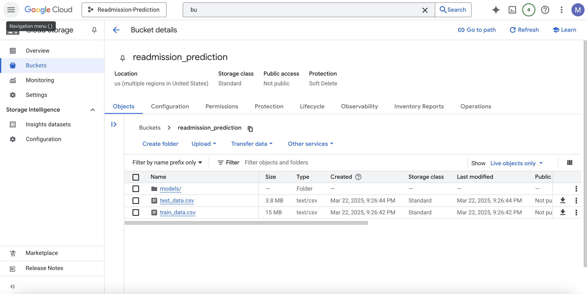
 
## End to End ML pipeline
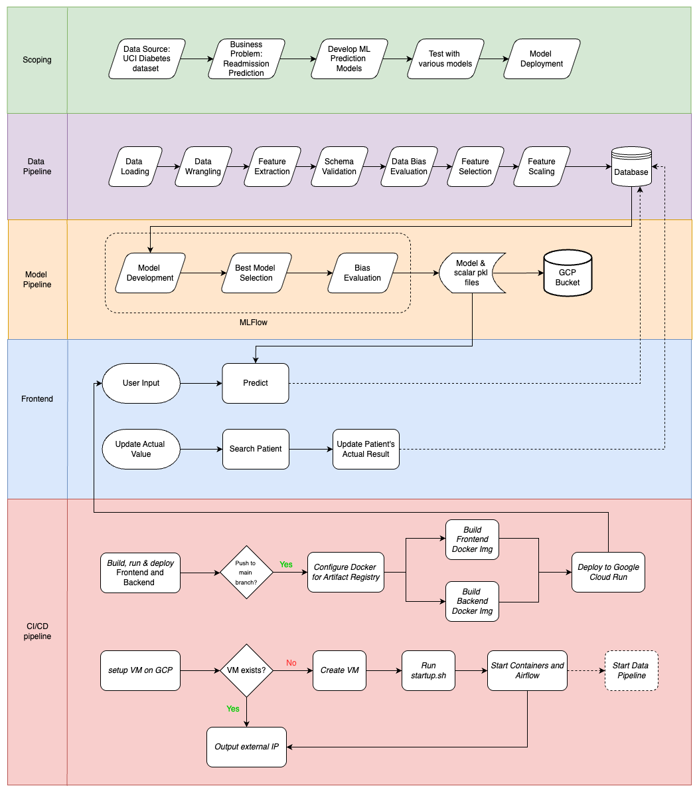


### Pipeline Optimization 
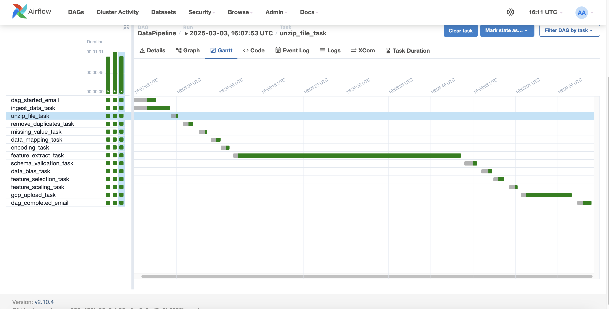

Pictured above: Airflow DAG Execution Gantt Chart for Data Pipeline. It is a popular project management tool used to visualize and track the progress of tasks or activities over time. It provides a graphical representation of a pipeline's schedule, showing when each task is planned to start and finish.

## Data preprocessing:

#### Handling Missing Values: 

Identified and addressed missing entries in the dataset to prevent biases and errors during model training. Techniques such as imputation or removal were applied based on the nature and extent of missingness.


#### Encoding Categorical Variables: 
Converted categorical features (e.g., gender, race, admission type) into numerical representations using methods like one-hot encoding, facilitating their use in machine learning algorithms.​


#### Feature Scaling: 
Standardized numerical features to ensure that each contributes equally to the model's learning process, preventing features with larger scales from dominating.​


#### Feature Selection and Engineering: 
Selected relevant features based on domain knowledge and statistical methods. Engineered new features, such as age from date of birth, to enhance model performance.​


#### Outlier Detection and Treatment: 
Identified anomalous data points that could skew the model's learning and applied appropriate methods to mitigate their impact.​


#### Data Splitting: 
Divided the dataset into training and testing subsets to evaluate model performance on unseen data, ensuring generalizability.​


#### Data Validation: 
Implemented validation checks to ensure data integrity and consistency throughout the preprocessing pipeline.

### Hyperparameter Tuning 

 The model development workflow automates the process of training, evaluation, and selecting the best-performing model. The training data is divided and stored in GCS, then retrieved for processing. XGBoost classifiers are employed with efficient hyperparameter tuning and experiment tracking.

 Hyperopt is utilized for hyperparameter optimization, leveraging the Tree-structured Parzen Estimator (TPE) algorithm. The following XGBoost hyperparameters are fine-tuned:

 - n_estimator
 - learning_rate
 - max_depth
 - min_child_weight
 - gamma 
 - booster

 Each combination is assessed using 3-fold cross-validation on the training data. The model with the best performance, determined by accuracy and F1 score, is selected, ensuring a balanced trade-off between precision and recall.


### Upload train and test to GCP

Splits the dataset into training and testing sets and uploads them to Google Cloud Storage (GCS). It handles errors gracefully by checking for bucket existence, logging progress, and retrying failed uploads. The processed data is first saved locally before being uploaded to GCS as CSV files.

### Email Alerts

Alerts on DAG Start, Complete and if any failure in tasks

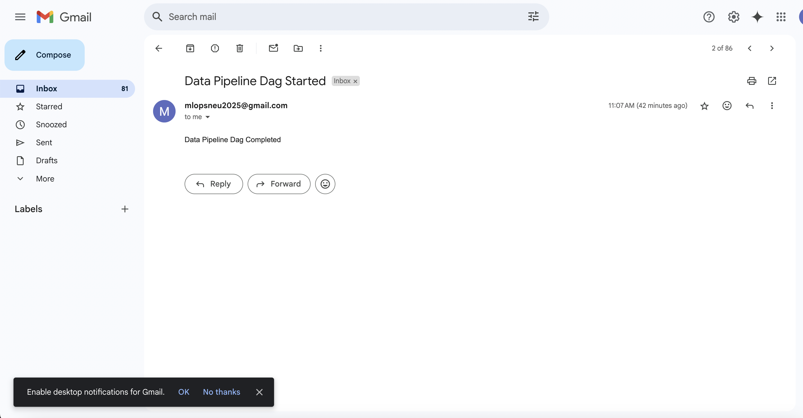

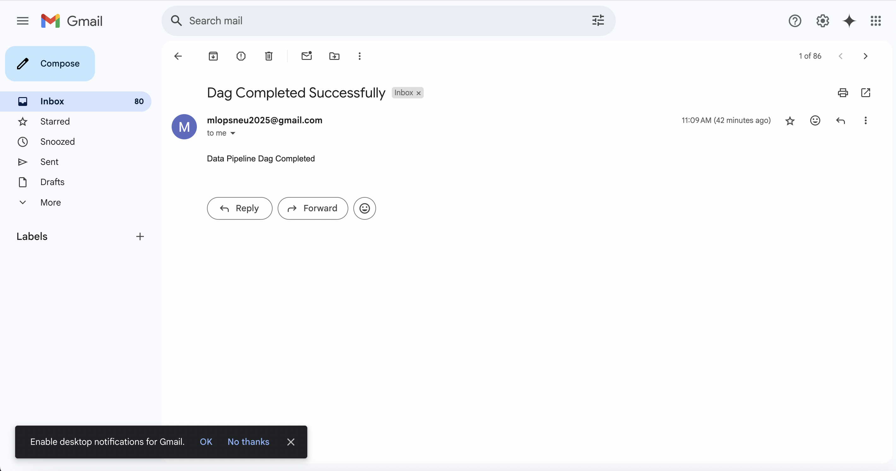

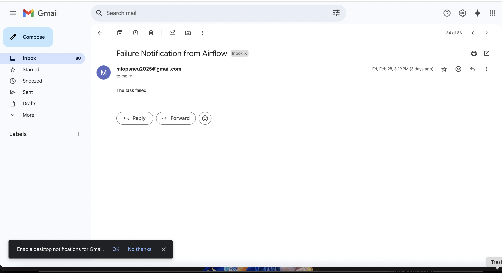

## Model Deployment on a GCP VM:

### Step 1: Create a VM Instance and Set Up Environment

The workflow authenticates with Google Cloud using a service account key stored securely as GCP_SA_KEY in GitHub Secrets. It then installs and configures the Google Cloud CLI (gcloud) to enable interactions with GCP services, including Compute Engine. The workflow also ensures that the Compute Engine API is enabled in the project, which is necessary for creating and managing virtual machine instances.

### Step 2: Trigger Deployment from GitHub

Deployment begins when the GitHub Actions workflow named Deploy Airflow VM on GCP is manually triggered using the workflow_dispatch event. This action allows users to deploy the full project—including Airflow, model pipeline, and supporting services—into a Google Cloud VM with just one click from the GitHub UI.
    
### Step 3: Provision the GCP Virtual Machine

The workflow defines a VM named airflow-vm in the us-central1-a zone. Before creating it, the workflow checks if the VM already exists to avoid unnecessary duplication. If not found, it provisions a new VM with the following configuration:

- Machine type: e2-standard-4 (4 vCPUs, 16 GB RAM)
- Boot disk: Ubuntu 22.04 LTS with 30 GB storage
- Network tags: http-server to allow inbound HTTP traffic
- Startup script: startup.sh, uploaded as instance metadata
- Metadata attributes: Sensitive information such as database credentials and SMTP settings are securely passed via instance metadata

This design ensures a reproducible and secure VM setup, with secrets injected at runtime rather than hardcoded.


## Bias Model Evaluation:

The bias_Evaluation() function assesses the fairness of the model by analyzing demographic biases related to gender and race. The process includes the following steps:

#### 1. Load Data and Model:
 - Retrieves the training and test datasets from the data/processed/ directory.
 - Loads the final model from the final_model/ directory.
 - Creates a "race" column, classifying data as Caucasian (1) or Other (0), while removing instances with missing values (except for African American records).

#### 2. Fairness Metrics Calculation (Using Fairlearn):
 - **Disparate Impact Ratio**: Measures the ratio of positive outcomes between different demographic groups.

 - **Demographic Parity Ratio**: Compares the positive prediction rates across sensitive groups.

 - **Equalized Odds Ratio**: Ensures equal false positive and false negative rates across demographic groups.


#### 3. Fairness Mitigation Using Fairlearn’s ThresholdOptimizer:
 To mitigate bias, Fairlearn’s ThresholdOptimizer is used with the "equalized_odds" constraint.

#### 4. Slice-Based Performance Evaluation:
 We perform data slicing to assess model performance across different demographic groups:
 - Slicing by Gender (gender_Male)
 - Slicing by Race (race)

Performance metrics such as accuracy, precision, recall, and F1-score are analyzed for each demographic group.

#### 5. Visualization and Interpretation of Bias Metrics:
 Generates bar plots to visualize model performance variations across demographic slices.
 Saves the bias analysis plots (Bias_Gender.png and Bias_Race.png) in the Bias_Plots/ directory.

 - **Disparate Impact**: A ratio of 1 indicates no disparity or equal impact across groups.
    - Gender (0.82): A slight imbalance, suggesting that one gender (likely females) is underrepresented.
    - Race (1.65): Significant disparity between racial groups in the model's predictions. Since the dataset is majority Caucasian, this result is expected.

 - **Demographic Parity Ratio (0.35)**: A value of 0.35 suggests the model is more favorable toward one group, which is expected given the majority Caucasian dataset.

 - **Gender Results**: Both genders show similar performance metrics, with a slight difference in F1-score (0.60 for males and 0.62 for females), indicating a moderate disparity in model performance between genders.

 - **Race Results**: Group 1.0 (likely Caucasian): Higher performance across all metrics (Accuracy: 0.70, Precision: 0.69, Recall: 0.70, F1-score: 0.67).

 - **Group 0.0 (likely non-Caucasian)**: Slightly lower performance across all metrics (Accuracy: 0.61, Precision: 0.62, Recall: 0.61, F1-score: 0.60).

Given the majority Caucasian dataset, these results are expected.
 Pictured below: Bias Race
 

 Pictured below: Bias Gender
 

## FastAPI - Backend API with Prediction Interface:

The backend for the Diabetic Readmission Prediction tool is built using FastAPI, hosted on port 8080, and deployed on a Google Cloud Platform (GCP) VM. This backend powers the real-time inference engine accessed by the healthcare staff via a frontend application.

Core Functionalities:
- /predict — Accepts patient information and returns model prediction.

- /update-actual-result — Allows manual entry of real patient outcomes to refine post-prediction evaluation.

- /search-patient — Looks up existing patient data, decodes it, and returns a user-friendly response.

### Frontend Integration

The frontend interface is designed to work with this FastAPI backend. Once the Launch Prediction Tool button is clicked, users are redirected to a form where they can:

- Enter real-time patient features

- Get an immediate prediction result

- Update true patient outcomes for ongoing model evaluation

The communication between frontend and backend is secured via CORS configuration, allowing cross-origin requests from: http://localhost:5173

## CI/CD Integration with GitHub Actions

The backend service is fully automated using GitHub Actions for Continuous Integration and Deployment (CI/CD). This ensures that any new changes pushed to the main branch are automatically tested, deployed, and ready for production.

 **Relevant CI/CD Files**:
   - CI/CD Workflow File: .github/workflows/CI_CD_gcp_fastapi.yml
   - Setup Script: setup-fastapi.sh
   - Startup Script: startup-fastapi.sh

### Automated CI/CD Integration

This project leverages GitHub Actions to implement Continuous Integration and Deployment (CI/CD) for the model pipeline. Any changes to the main branch automatically trigger the pipeline, enabling smooth and automated updates and deployments.

    - ● Code yml file : .github/workflows/GCP_deploy.yml
    - ● Startup and Setup script for CI-CD : startup.sh

### Overview
This project leverages two GitHub Actions workflows to automate end-to-end deployment and orchestration in a production-like environment:

 1. Build, Push & Deploy to Cloud Run:
      This workflow is automatically triggered whenever changes are pushed to specific branches and relevant paths (frontend/backend code or Dockerfiles). It performs the following:

      - Builds Docker images for both frontend and backend services.
      - Pushes these images to Google Artifact Registry.
      - Deploys the services to Google Cloud Run, ensuring zero-downtime and scalable deployment.


 2. Deploy Airflow VM on GCP:
      This is a manually triggered (workflow_dispatch) pipeline designed to:
      - Spin up a new Compute Engine VM instance if it doesn't already exist.
      - Deploy Apache Airflow using a startup script (startup.sh), setting up the orchestration environment for running ML workflows.
      - Expose Airflow via the VM's external IP on port 8080, enabling web access.

These CI/CD workflows ensure that:
- The latest code and models are automatically tested and deployed with every valid push.
- The infrastructure for ML orchestration (Airflow) can be set up on-demand, supporting scalability and experimentation.
- Environment variables and secrets are securely managed via GitHub Secrets, maintaining both security and automation.

#### Step 1: Set Up a Service Account

- Go to the GCP Console and Navigate to the IAM & Admin → Service Accounts
- Create a New Service Account: Click + Create Service Account.
- Fill in the Service Account Name and Description. Click Create and Continue.

#### Step 2: Assign Roles to the Service Account
 - Navigate to the Service Accounts section and locate your newly created service account. Click on the email ID to open its details.
 - Go to the Permissions tab, click Grant Access, then choose Add Another Role. Assign roles relevant to your CI/CD pipeline requirements, such as access to Cloud Run, Artifact Registry, Compute Engine, or Storage.
     - Cloud Run Admin (roles/run.admin) — To manage Cloud Run services, including deploying, updating, and deleting services.
     - Artifact Registry Reader (roles/artifactregistry.reader) — To allow access to view and pull container images from the Artifact Registry.
     - Compute Admin (roles/compute.admin) — To manage and administer Google Compute Engine resources, including creating, modifying, and deleting VMs, disks, and related compute resources.
     - Service Account User (roles/iam.serviceAccountUser) — To allow impersonation of this service account, enabling workflows to act on its behalf for API calls or deployments.
     - Owner (roles/owner) — Grants full access to all resources, including the ability to manage IAM roles and permissions.
     - Viewer (roles/viewer) — Read-only access to all resources, allowing monitoring and auditability without modification access.

After assigning the roles, click Save to apply the changes.
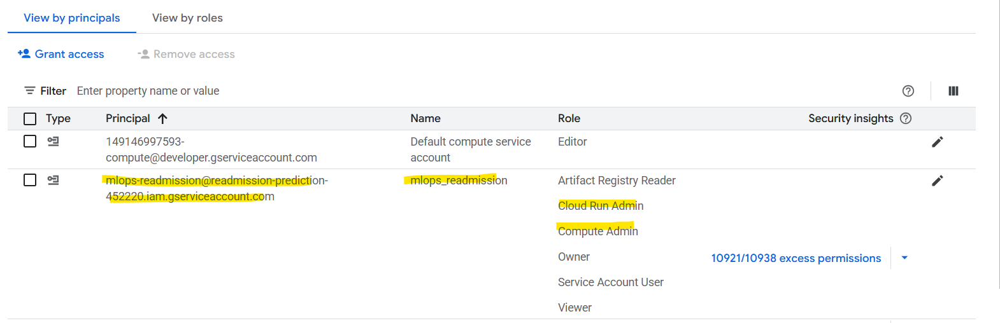

#### Step 3: Service Account key
For our custom-created service account, we have generated a key file, which can now be used for authentication in local development or CI/CD environments.

#### Step 4: Add the Key to GitHub Secrets
Go to Your GitHub Repository: Navigate to the repository → Settings → Secrets and variables → Actions → New repository secret. Add a New Secret: GCP_SA_KEY -> Copy and paste the contents of the JSON key file 

#### Step 5: Update Your GitHub Actions Workflow
Add the secret key in the workflow as below, (gcp_vm_setup.yml)
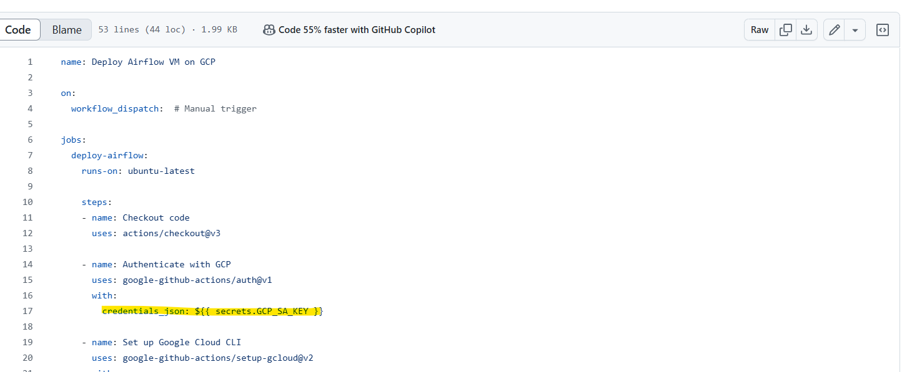

All steps are automated through GitHub Actions using gcloud CLI commands. A custom service account with the required roles is authenticated using a service account key stored securely in GitHub Secrets.

## CI/CD Implementation
### CICD - Run
When the workflows are completed successfully:
  1. Build, Push & Deploy to Cloud Run:
     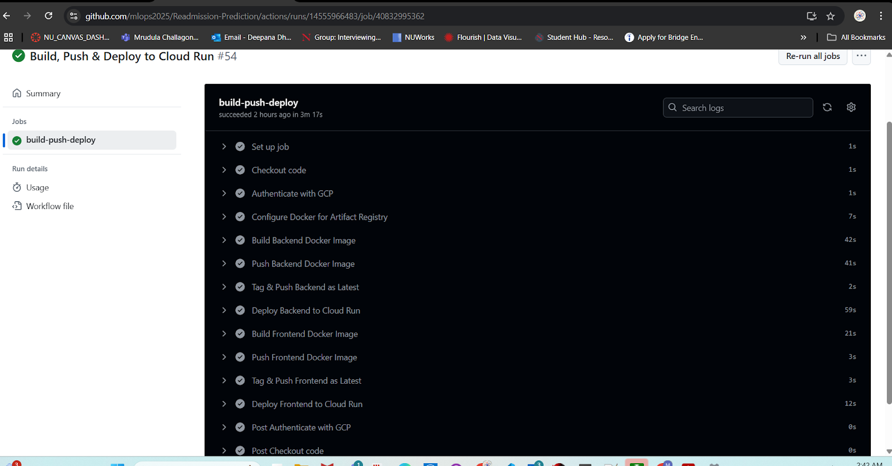

  2. Deploy Airflow VM on GCP:
     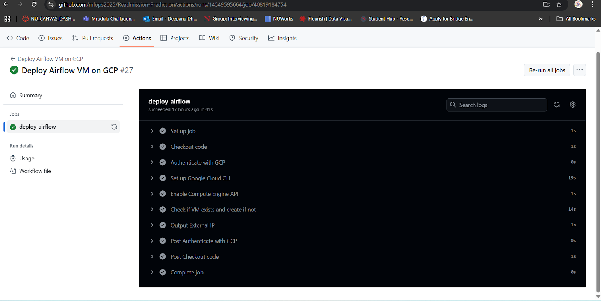

Total Run time Durations of both:
  1. Build, Push & Deploy to Cloud Run: 3m 17s
     

  2. Deploy Airflow VM on GCP: 41s
     

### CICD - Validation

#### Logging and Monitoring
In our system, we utilize Google BigQuery to log and monitor the performance of our machine learning models and infrastructure. This enables us to ensure optimal performance and scalability by tracking key metrics such as model response timings and VM instance CPU utilization.

#### Big Query:
 - **Step 1: Create Dataset**
    - Navigate to Google Console then search Big Query 
    - Open Big Query Studio, then right click project create Dataset 
    - Enter the below details
       - NAME: Model_Metrics
       - DATA LOCATION: US 
    - Click create Dataset

 - **Step 2: Create a Table**
    - Navigate to the newly created Dataset, click the three dots and click New Table
    - Enter the details as below,
       - Name: Model_Metrics_table
    - Data Location: US
    - Click create table
    - Navigate to schema section and click edit schema and paste the below content
    ```sh
      [
      {"name": "timestamp", "type": "timestamp", "mode": "NULLABLE"},
      {"name": "endpoint", "type": "STRING", "mode": "NULLABLE"},
      {"name": "input_data", "type": "STRING", "mode": "NULLABLE"},
      {"name": "prediction", "type": "STRING", "mode": "NULLABLE"},
      {"name": "response_time", "type": "FLOAT", "mode": "NULLABLE"},
      {"name": "status", "type": "STRING", "mode": "NULLABLE"}
      ] ```


## Dashboard:

 Streamlit dashboard to visualize and analyze patient readmission data. It performs the following tasks:

 - **1. Data Loading & Preprocessing**:
     - Loads scaled patient data from a PostgreSQL database.
     - Reverses scaling for original values using a scaler stored in Google Cloud Storage (GCS).

 - **2. Streamlit UI**:
     - Displays patient visit history, health index vs. readmission status, and readmission analysis with bar charts.
     - Shows data visualizations of diagnoses by severity level and disease severity vs. health index.
     - Presents medication usage stats and distributions.

  This dashboard helps in monitoring patient health status, visualizing readmission trends, and evaluating model performance for predicting readmissions.

  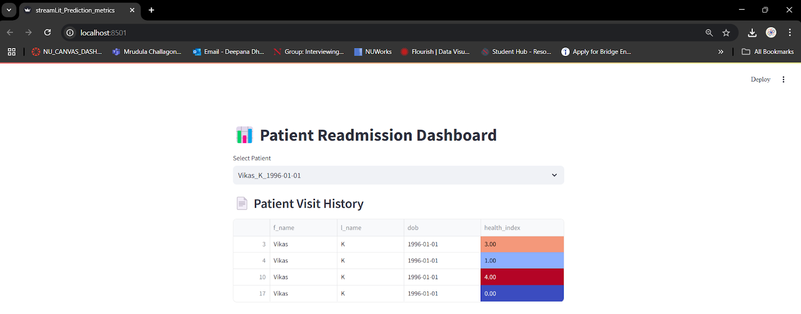
  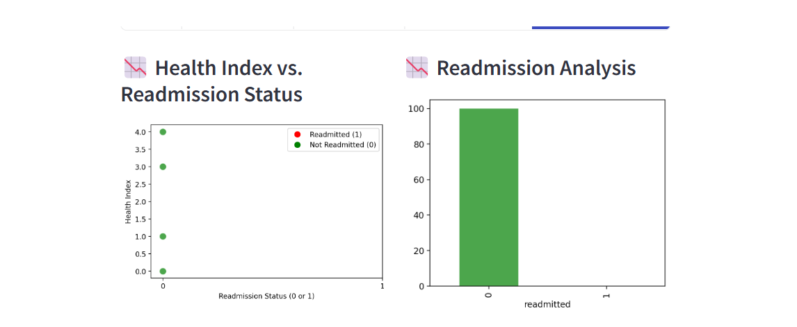
  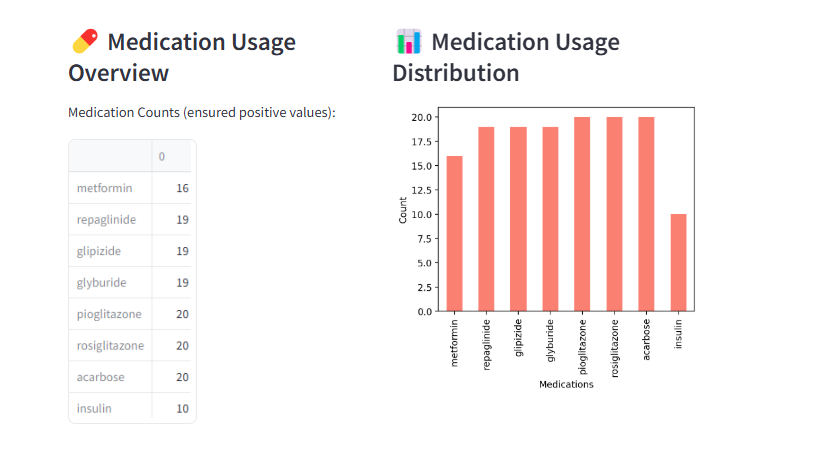
  

### Dashboard (Monitoring Response time)
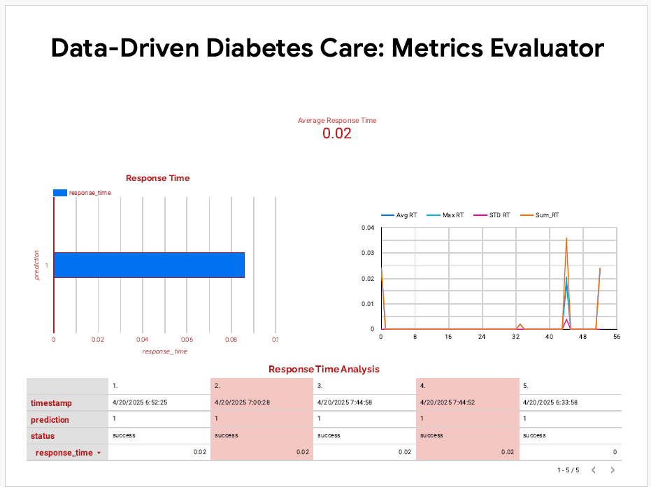

### VM instance CPU Utilization
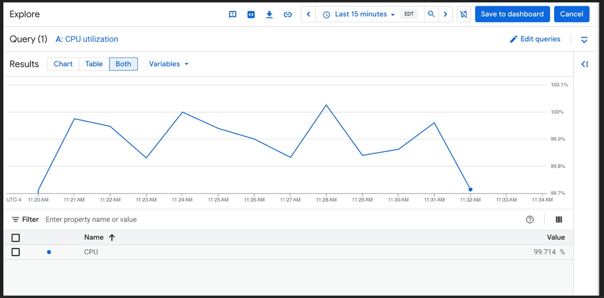


